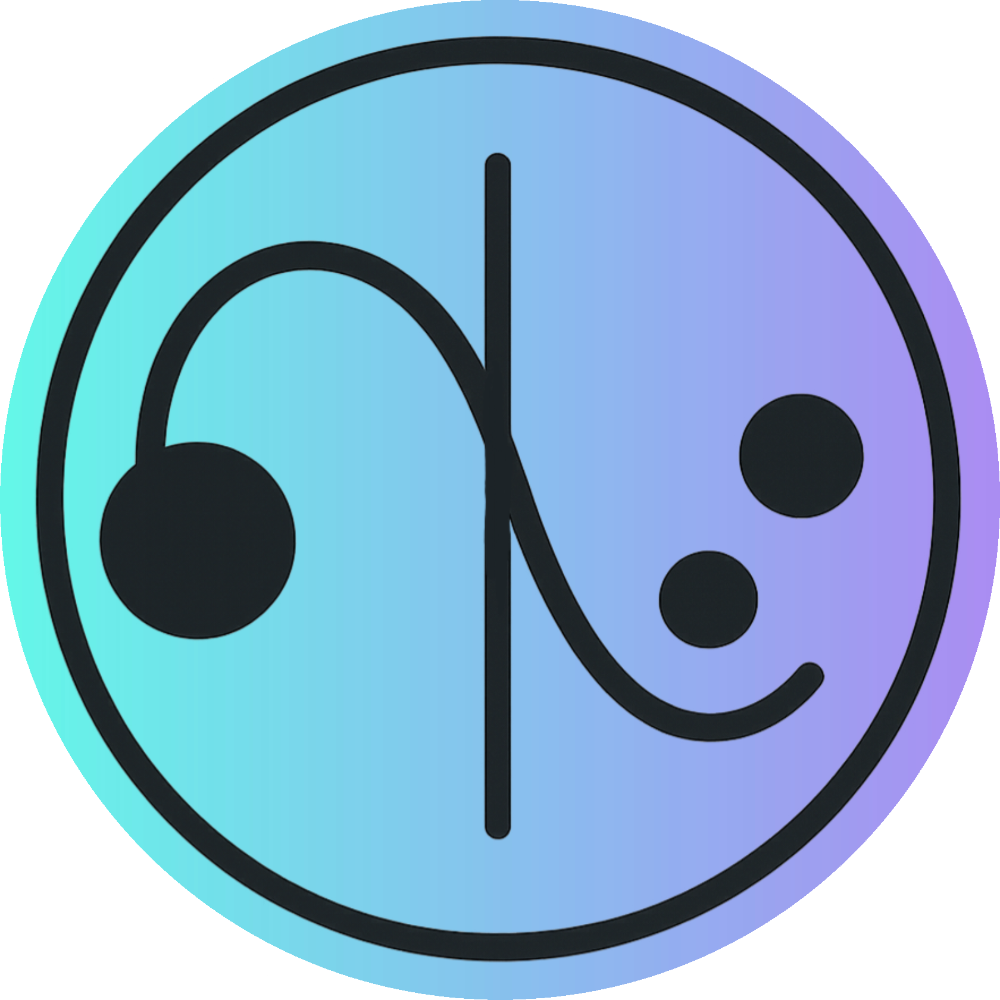

<h1 style="display: flex; align-items: center;">
    
    NQT (Non-Quantum Tunneling)
</h1>

    Программы, хранящиеся здесь — иллюстрация того, что за необычным поведением квантовых объектов может скрываться не столько странность законов квантовой физики, сколько сложность устройства пространства на малых масштабах. В данном случае я предлагаю рассмотреть ситуацию, в которой пространство имеет 3 обычных измерения и несколько компактных. Последние представляют собой не оси, а отрезки, перпендикулярные трем основным измерениям. Их форма сейчас не важна — они могли бы быть не отрезками, а окружностями или кривыми — это никак не повлияло бы на симуляцию, потому что здесь значимо только то, что в каждой точке появляется возможность отойти от основного трехмерного пространства на некоторое расстояние. Если из-за попадания в компактное измерение частица оказывается на расстоянии больше собственного радиуса от трехмерного пространства, то она полностью выходит из него и не взаимодействует с находящимися там объектами, пока снова хотя бы частично не выйдет из скрытого измерения. Таким образом у частиц, которые в программе представлены просто как упругие шары, двигающиеся равномерно в случайных направлениях (включая компактные), появляется возможность огибать препятствия в трехмерном пространстве через дополнительные измерения. Теперь они могут проникать сквозь барьеры!

    Это напоминает эффект квантового туннелирования, однако я не предлагаю такую модель как объяснение реального явления. Программа представляет скорее творческий интерес, чем научный. Она дает повод для размышлений о том, что интерпретация сложных и зачастую контринтуитвных законов квантовой физики может сильно отличаться от наших текущих представлений.

<h2>Структура репозитория</h2>
<ul>
    <li><strong><a href="./application/">application/</a></strong> — приложение для запуска симуляции.</li>
    <li><strong><a href="./pictures/">pictures/</a></strong> — картинки для наглядности описания в README.md.</li>
    <li><strong><a href="./source code/">source code/</a></strong> — исходный код и вспомогательные компоненты.</li>
</ul>

    

